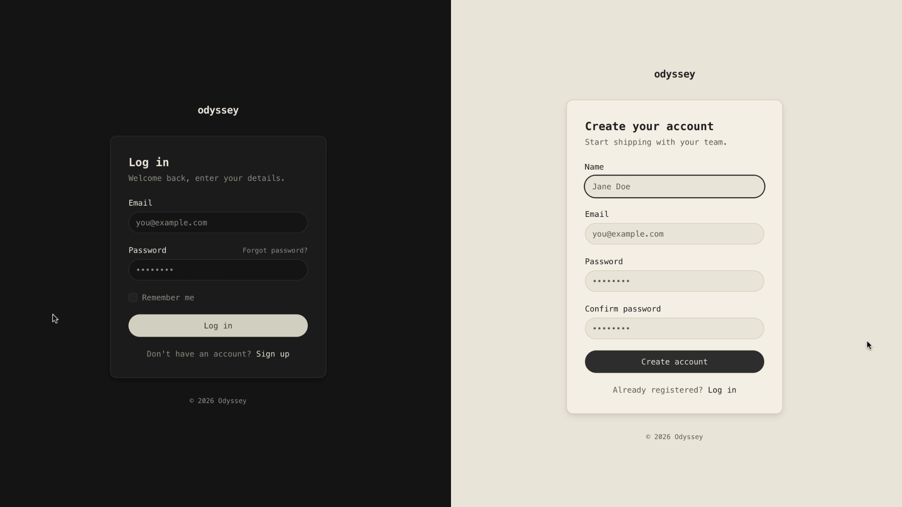
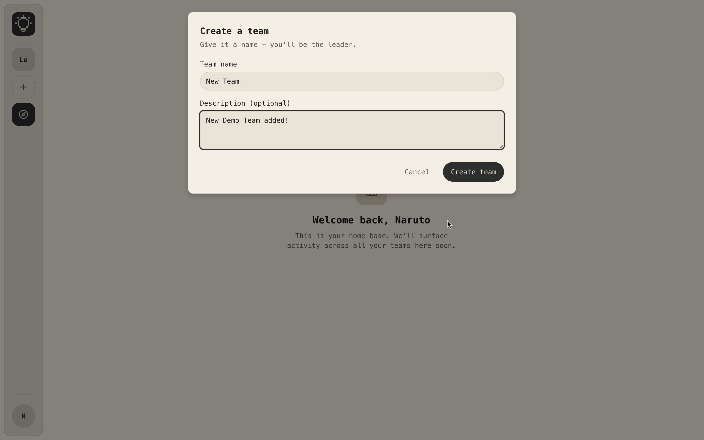
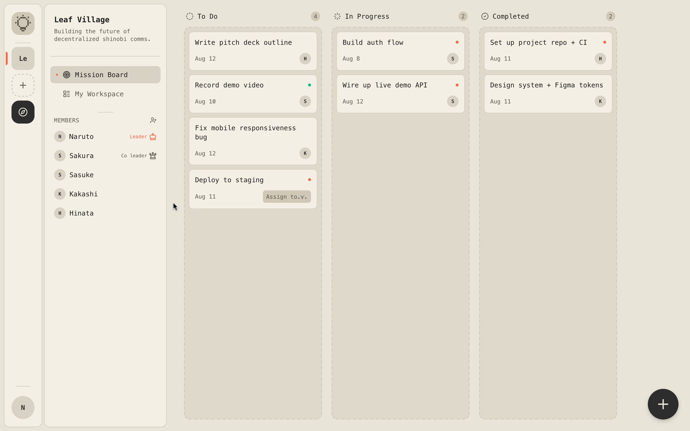
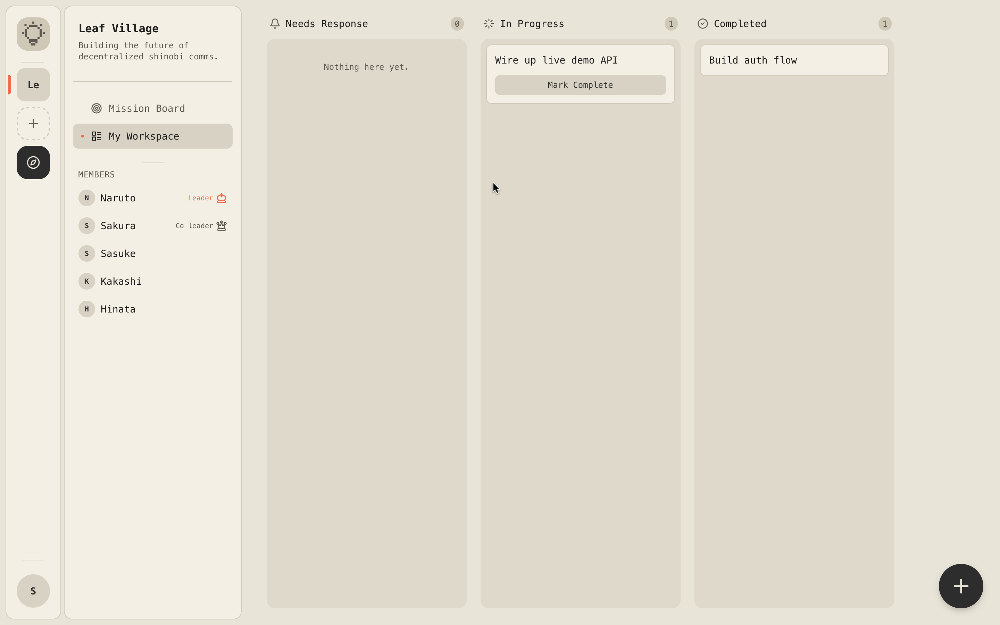
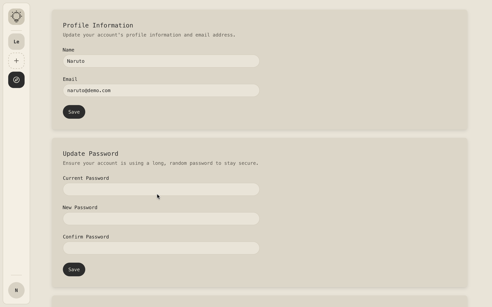

# Odyssey

Odyssey is a Laravel collaboration workspace for teams that need a focused place to create work, assign it, and track progress through to completion. It combines authenticated web screens and a bearer-token API so the same task flow can be used from the browser or from API clients.

Version v1.0.0 delivers the core task management and collaboration workflow: team setup, member management, task assignment, task responses, and completion tracking.

## Features

- Authentication with registration, login, logout, password reset, and email verification
- Session-authenticated web experience
- Profile management for updating account details, password, and account deletion
- Team creation and team membership management
- Role-based access control through team roles
- Mission Board for team-level task tracking
- My Workspace for personal assignment tracking
- Task creation, assignment, acceptance, rejection, and completion
- Self-assigned workspace tasks
- REST API for teams, members, tasks, and assignments
- Sanctum bearer token authentication for API clients

## Screenshots

Placeholder paths are listed below until exported screenshots are added to the repository.

### Authentication

Combined Login and Register screen.



### Team Creation

Team creation modal and onboarding flow.



### Mission Board

Team mission board with task status columns.



### My Workspace

Personal workspace for reviewing and responding to assigned work.



### Profile Update

Profile settings for updating user details and account security.



## Technology Stack

- PHP 8.3
- Laravel 13.8
- Blade
- Laravel Breeze
- Laravel Sanctum
- Alpine.js
- Tailwind CSS 4
- Vite
- SQLite default database configuration
- Lucide icons via `mallardduck/blade-lucide-icons`

## Project Metrics

- Controllers: 24
- Models: 4
- Policies: 2
- Migrations: 10
- Database tables: 13
- Seeders: 1
- Web routes: 32
- API routes: 14
- Blade component views: 16

## Architecture Overview

Odyssey uses a Laravel backend with a Blade-rendered web layer for session-authenticated users and a Sanctum-protected JSON API for bearer-token clients. Authorization is policy-driven and centered on team roles, while the task workflow is organized around teams, tasks, assignments, and assignment states.

## Project Structure

```text
.
├── README.md
├── app
│   ├── Http
│   ├── Models
│   ├── Policies
│   ├── Providers
│   └── View
├── artisan
├── bootstrap
│   ├── app.php
│   └── providers.php
├── composer.json
├── composer.lock
├── config
│   ├── app.php
│   ├── auth.php
│   ├── cache.php
│   ├── database.php
│   ├── filesystems.php
│   ├── logging.php
│   ├── mail.php
│   ├── queue.php
│   ├── sanctum.php
│   ├── services.php
│   └── session.php
├── database
│   ├── database.sqlite
│   ├── factories
│   ├── migrations
│   └── seeders
├── package-lock.json
├── package.json
├── phpunit.xml
├── public
│   ├── favicon.ico
│   ├── hot
│   ├── index.php
│   ├── robots.txt
│   └── screenshots
├── resources
│   ├── css
│   ├── js
│   └── views
├── routes
│   ├── api.php
│   ├── auth.php
│   ├── console.php
│   └── web.php
├── tests
│   ├── Feature
│   ├── TestCase.php
│   └── Unit
└── vite.config.js

23 directories, 31 files
```

## App Structure

```text
app
├── Http
│   ├── Controllers
│   └── Requests
├── Models
│   ├── Task.php
│   ├── TaskAssignment.php
│   ├── Team.php
│   └── User.php
├── Policies
│   ├── TaskPolicy.php
│   └── TeamPolicy.php
├── Providers
│   └── AppServiceProvider.php
└── View
    └── Components

9 directories, 7 files
```

## Getting Started

```bash
git clone https://github.com/KrrishVardhan/odyssey
cd theodyssey
composer install
npm install
cp .env.example .env
php artisan key:generate
```

Configure your database connection in `.env`, then run:

```bash
php artisan migrate
php artisan db:seed
npm run dev
php artisan serve
```

## API

The API exposes 14 routes total. Authentication starts with `POST /api/login`, which returns a Sanctum bearer token; the remaining endpoints are protected by `auth:sanctum`. The API covers the current user, team listing and creation, team details, team member management, team task listing and creation, personal task listings, task assignment, assignment responses, and completion updates.

## Current Status

Odyssey is currently at v1.0.0. This release ships the core collaboration flow: authentication, team creation, member management, mission board visibility, personal workspace tracking, task assignment, accept/reject responses, completion tracking, profile management, and API access.

## Roadmap

- Team discovery
- Invitation flow improvements
- Activity notifications
- Dashboard activity feed
- Public API expansion
